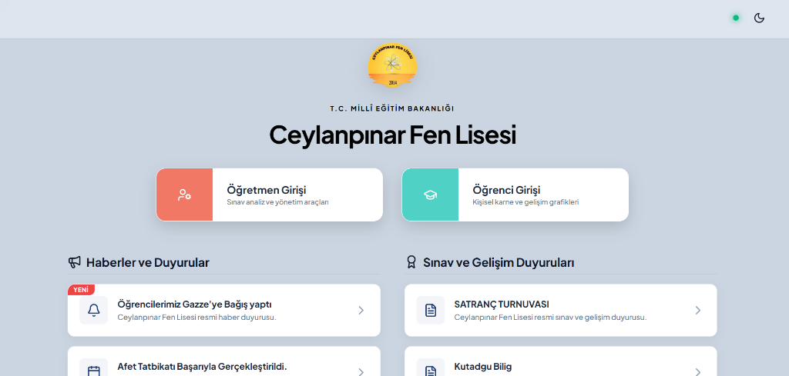
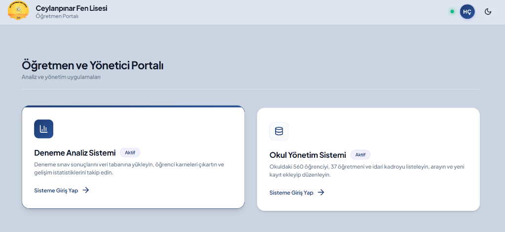

# CFL Portal

Bu proje, staj sürecinde geliştirdiğim bir okul yönetim ve analiz portalıdır. Okulun ihtiyaçlarını yerinde gözlemleyerek başlattım; başlangıçta basit bir sınav analizi aracı olarak tasarladım, ancak zamanla öğretmenlerin ve yönetimin farklı ihtiyaçlarını da karşılayacak şekilde genişledi.

## Proje Hakkında

Staj boyunca fark ettim ki öğretmenler sınav sonuçlarını her dönem manuel olarak Excel'de işliyor, karnemizi elle hazırlıyor ve duyuruları ayrı ayrı takip ediyordu. Bunu daha verimli bir hale getirebileceğimi düşündüm. Sonuç olarak ortaya, tarayıcıda çalışan, kurulum gerektirmeyen ve okulun günlük iş akışına entegre olabilecek tek sayfalık bir web uygulaması çıktı.

Proje hâlâ geliştirilmeye devam ediyor.

## Neler Yapıyor?

### Sınav Analizi
Öğretmenler `.xlsx` uzantılı sınav sonuç dosyasını sürükle-bırak yöntemiyle yükleyebiliyor. Portal bu dosyayı okuyarak otomatik olarak:
- Sınıf bazında net ortalamaları hesaplıyor
- Öğrencilerin ders ders performansını grafiklerle gösteriyor
- Sınıf geneli için karşılaştırmalı bir tablo sunuyor

### Öğrenci Yönetimi
Öğrenci kayıtları Supabase veritabanında tutuluyor. Portaldan doğrudan:
- Yeni öğrenci eklenebilir ve bilgileri düzenlenebilir
- Öğrenci arama yapılabilir
- Kayıt silinebilir

### Belge Üretimi
Öğrenci bilgileri üzerinden tek tıklamayla resmi görünümlü belgeler oluşturulabiliyor. İsim bilgisi gizlenmiş (isimsiz) versiyon da ayrıca üretilebiliyor. Belgeler doğrudan yazdırmaya hazır biçimde açılıyor.

### MEB Haber Akışı
Netlify Functions aracılığıyla MEB'in resmi sitesinden haberler çekilerek portal ana sayfasında listeleniyor.

### Kimlik Doğrulama
Supabase Auth kullanılıyor. Sisteme yeni personel eklendiğinde auth hesabı otomatik olarak oluşturuluyor.

### Tema Desteği
Açık ve koyu tema arasında geçiş yapılabiliyor. Tema tercihi oturum boyunca hafızada tutuluyor.

## Kullanılan Teknolojiler

| Katman | Teknoloji |
|--------|-----------|
| Arayüz | Vanilla HTML / CSS / JavaScript |
| Veritabanı | [Supabase](https://supabase.com) (PostgreSQL) |
| Auth | Supabase Auth |
| Sunucu Fonksiyonları | Netlify Functions |
| Excel Okuma | SheetJS (xlsx) |
| Grafikler | Chart.js |
| İkonlar | Lucide Icons |
| Font | Plus Jakarta Sans |

Projeyi olabildiğince sade tutmak istedim; yüklenmesi hızlı, kurulumu yok, tarayıcıda direkt çalışıyor.

## Ekran Görüntüleri

## Geliştirici

**Ali Zengin** / [github.com/alizng1n](https://github.com/alizng1n)
